# Voting Machine Fraud in the State of Ohio

This exposes the pattern between voter turnout and age that proves voting machine fraud in Ohio was used in the 2020 General Presidential Election.

## Results

The following plots show how accurate predictions of votes cast can be, given just registrations and overall turnout, in 8 of the 10 largest counties in Ohio.

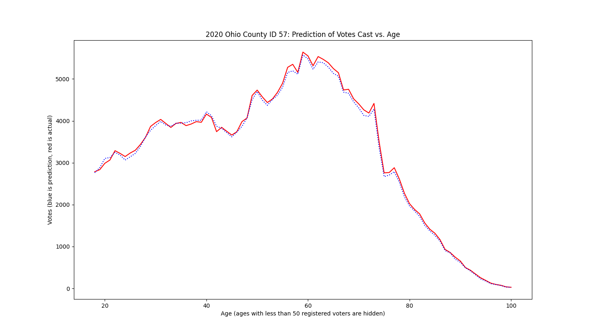
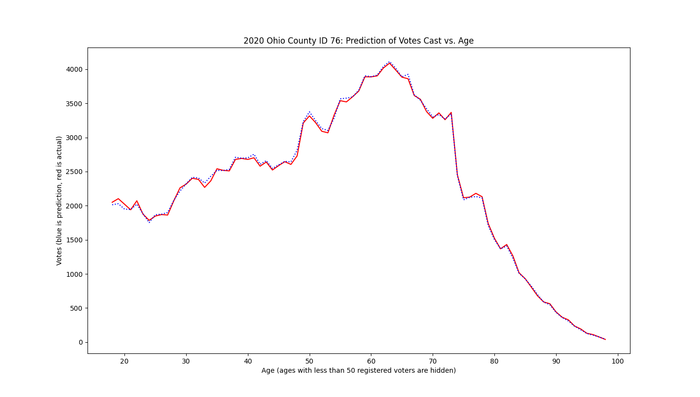
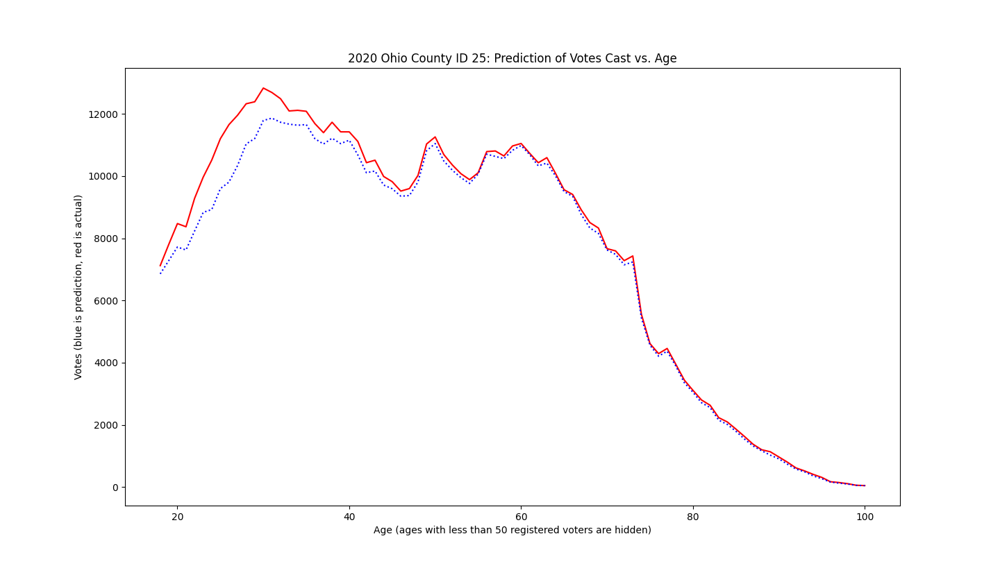
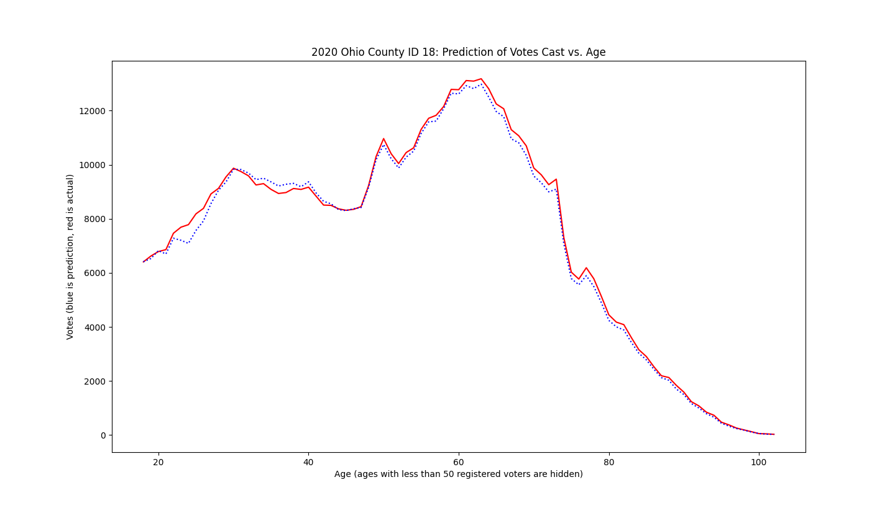
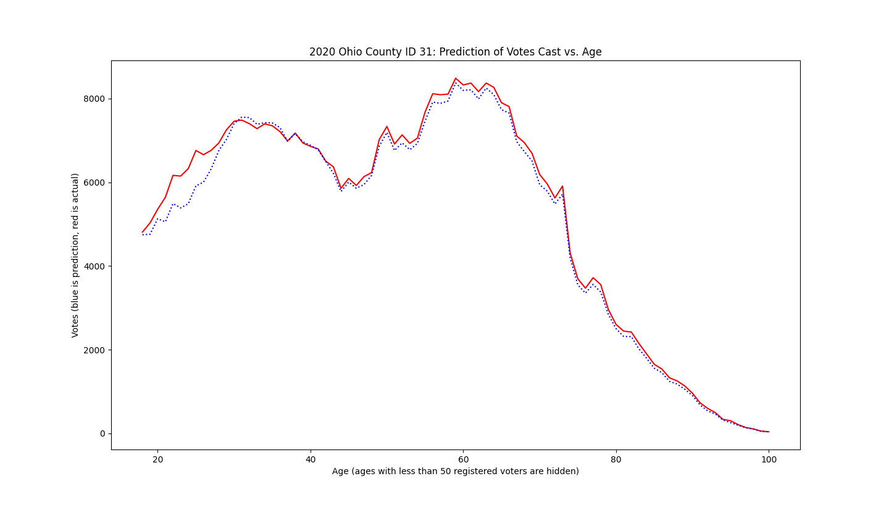

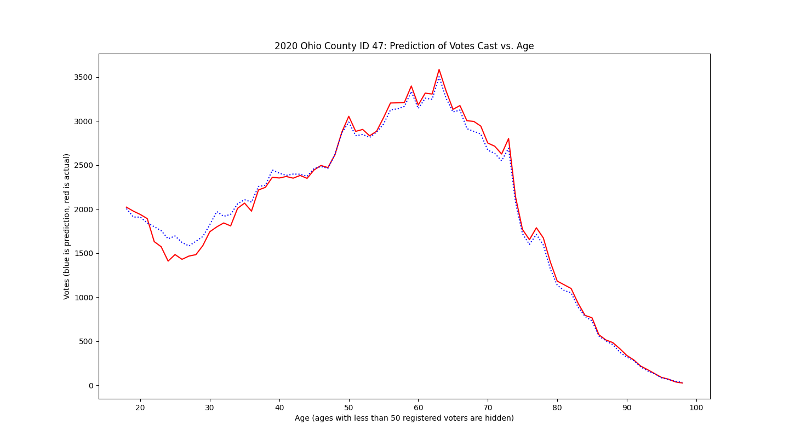
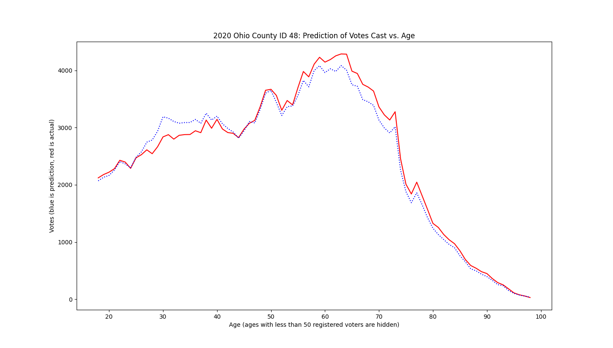
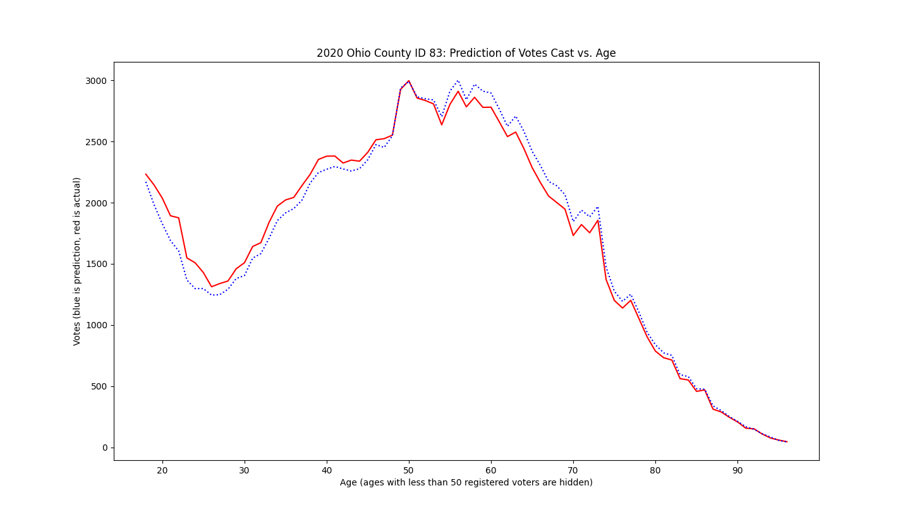

Note that the following normalized voter turnout plots were generated with the 2020 voter roll for all years.

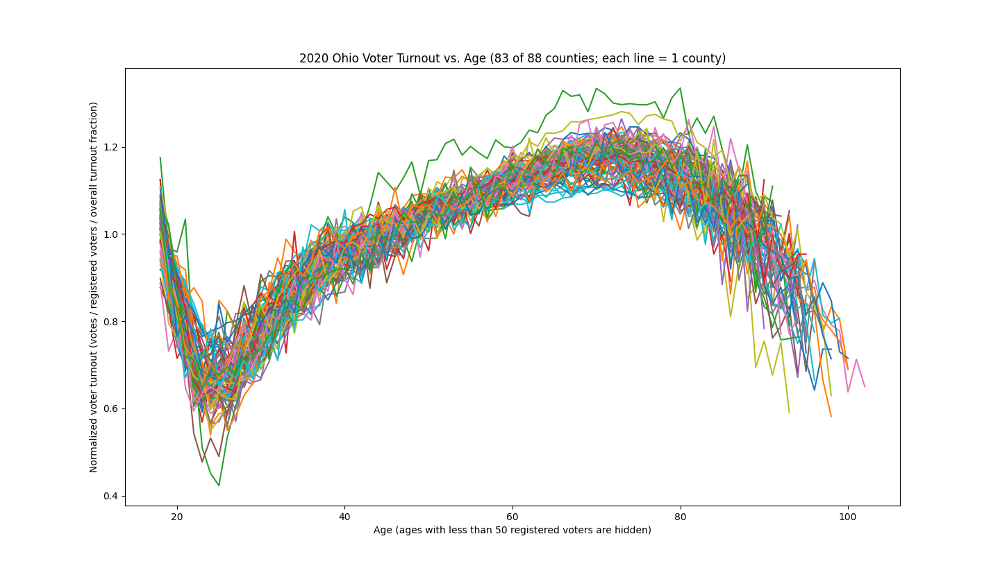
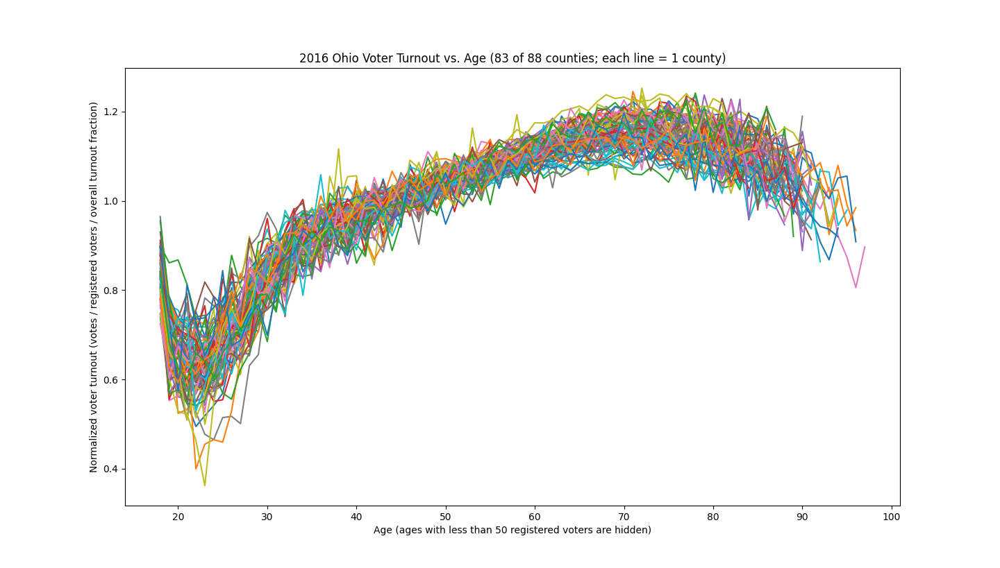
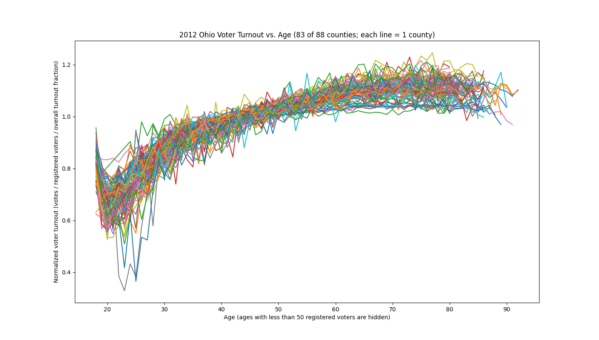
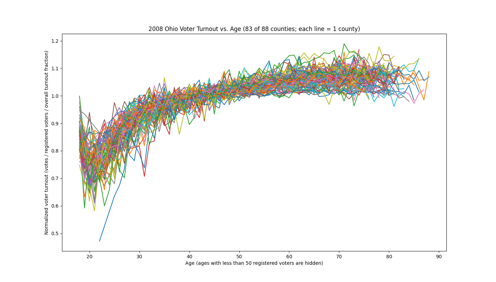
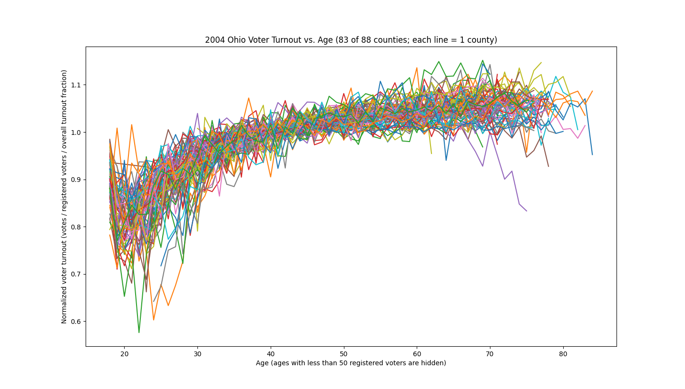
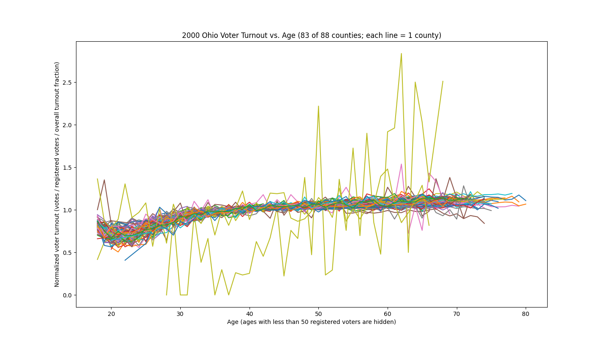

## Setup

Requires python3 and curl. Before running, be sure you have enough free space for the downloaded CSV files and converted JSON files. Should be on the order of 1 GB for all 88 counties in Ohio.

## Running: Voter Turnout Plots

1. Download voter registration database (may take a while): `./download_voter_database.py`
2. Convert raw csv data to json (also may take a while): `./jsonify.py`
3. Finally, plot voter turnout lines vs. age for all counties on the same plot: `./plot_turnout_by_age.py`.
    To plot just a single county, `./plot_turnout_by_age.py COUNTY_ID`, e.g. `./plot_turnout_by_age.py 49`.

## Running: Ballot Prediction Plot

1. Download voter registration database (may take a while): `./download_voter_database.py`
2. Convert raw csv data to json (also may take a while): `./jsonify.py`
3. Generate conversion key that helps us predict the number of votes: `./generate_key.py`
3. Finally, plot prediction vs. actual votes for a specified county: `./predict.py COUNTY_ID`, e.g. `./predict.py 25` for Franklin County.
    See the included PDF for a mapping of county names to county IDs.

## Data source

Links are hard-coded in the python code and may break if websites are changed.

Ohio voter registration database: https://www6.ohiosos.gov/ords/f?p=VOTERFTP:HOME:::#cntyVtrFiles

Ohio county codes / IDs: https://jfs.ohio.gov/performancecenter/fastfacts/ohio_counties_with_county_codes.pdf
